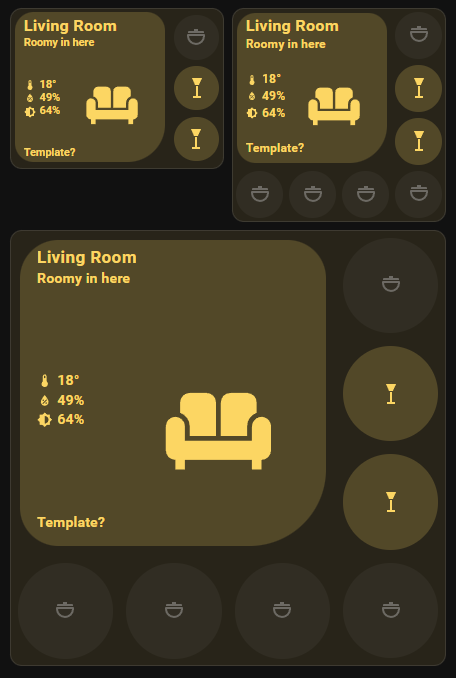

# Chamber Card



A Home Assistant Lovelace card for showing a room, area, or zone as a clean visual control tile with:

- a large central icon
- a room title
- optional description and extra info text
- optional temperature, humidity, and brightness readouts
- up to 7 quick-action buttons
- navigation on tap and entity control on hold

It works well for living rooms, bedrooms, kitchens, offices, media rooms, hallways, garages, and other spaces where you want both a quick overview and a few useful controls.

This card was inspired by the UI Lovelace Minimalist Room card:
[UI Lovelace Minimalist Room card](https://ui-lovelace-minimalist.github.io/UI/usage/cards/card_room/)

AI was used to help create this card.

## HACS

### Install with HACS custom repositories

1. Open HACS in Home Assistant.
2. Open the menu in the top-right corner.
3. Select `Custom repositories`.
4. Add `https://github.com/Rhaenon/chamber-card`.
5. Select category `Dashboard`.
6. Install `Chamber Card`.

HACS should normally register the dashboard resource automatically. If it does not, add this resource manually:

```yaml
- url: /hacsfiles/chamber-card/chamber-card.js
  type: module
```

### Install manually

Copy these release files into your Home Assistant `www/community/chamber-card/` folder:

- `chamber-card.js`
- `chamber-card-editor.js`

Then add the resources in Lovelace.

## What This Card Can Do

### Main card

- Shows a room title and icon
- Supports an optional main entity
- Supports tap navigation to another dashboard or URL
- Supports hold-to-toggle on the main entity
- Applies an active color when the main entity is active

### Status and info

- Shows a description line from:
  - plain text
  - an entity state
  - a Home Assistant template
- Shows an extra info line from:
  - plain text
  - an entity state
  - a Home Assistant template
- Supports inline `mdi:` icons inside text
- Can show temperature, humidity, and brightness values

### Quick-action buttons

- Supports up to 7 buttons in the full layout
- Supports 3 buttons in compact mode
- Each button can:
  - toggle an entity
  - open more-info
- Each button can use its own active color

### Unavailable main entity handling

If the main entity is missing, `unknown`, or `unavailable`:

- the card still renders
- the main active-state styling is disabled
- brightness is hidden
- the main hold-to-toggle behavior is disabled
- a warning badge with an exclamation icon is shown

This lets the room card stay visible even if one device goes offline.

## Installation

### Required resource

```yaml
- url: /local/community/chamber-card/chamber-card.js
  type: module
```

### Recommended editor resource

If you want the visual editor in the Lovelace UI, also add:

```yaml
- url: /local/community/chamber-card/chamber-card-editor.js
  type: module
```

## Basic Example

```yaml
type: custom:chamber-card
chamberCaption: Living Room
chamberIcon: mdi:sofa
entity: light.living_room
show_temperature: true
temperature_entity: sensor.living_room_temperature
show_humidity: true
humidity_entity: sensor.living_room_humidity
button1_entity: light.floor_lamp
button1_action: toggle
button2_entity: media_player.living_room_tv
button2_action: more-info
button3_entity: switch.candles
button3_action: toggle
```

## Navigation Example

Use the main card as a room shortcut:

```yaml
type: custom:chamber-card
chamberCaption: Bedroom
chamberIcon: mdi:bed-king
entity: light.bedroom_group
navigation_path: /lovelace/bedroom
button1_entity: light.bedside_left
button1_action: toggle
button2_entity: light.bedside_right
button2_action: toggle
button3_entity: climate.bedroom
button3_action: more-info
```

## Text And Template Example

Use templates and inline icons for dynamic room status:

```yaml
type: custom:chamber-card
chamberCaption: Kitchen
chamberIcon: mdi:silverware-fork-knife
entity: light.kitchen
description_as_entity: false
description_value: "{{ states('input_select.kitchen_mode') }}"
extra_line_as_entity: false
extra_line_value: "mdi:window-open Window openmdi:window-closed Window closed"
show_temperature: true
temperature_entity: sensor.kitchen_temperature
show_humidity: true
humidity_entity: sensor.kitchen_humidity
```

## Compact Layout Example

Use compact mode when you want a smaller card:

```yaml
type: custom:chamber-card
chamberCaption: Office
chamberIcon: mdi:desk
entity: light.office
compact_layout: true
button1_entity: light.office_desk
button1_action: toggle
button2_entity: switch.office_fan
button2_action: toggle
button3_entity: media_player.office_speaker
button3_action: more-info
```

## Card Without Main Entity Example

The main entity is optional. This is useful when you want a room tile that mainly acts as a visual launcher plus quick controls:

```yaml
type: custom:chamber-card
chamberCaption: Utility Room
chamberIcon: mdi:washing-machine
navigation_path: /lovelace/utility
description_value: Laundry and storage
show_temperature: true
temperature_entity: sensor.utility_temperature
button1_entity: switch.washer
button1_action: more-info
button2_entity: switch.dryer
button2_action: more-info
button3_entity: light.utility_room
button3_action: toggle
```

## Full Example

```yaml
type: custom:chamber-card
chamberCaption: Bedroom
chamberIcon: mdi:bed-king
entity: light.bedroom_group
navigation_path: /lovelace/bedroom
active_color: "#d9b85f"

description_as_entity: false
description_value: "{{ states('input_select.bedroom_scene') }}"

extra_line_as_entity: false
extra_line_value: "mdi:window-open Window openmdi:window-closed Window closed"

show_temperature: true
temperature_entity: sensor.bedroom_temperature
show_humidity: true
humidity_entity: sensor.bedroom_humidity
show_brightness: true

compact_layout: false

button1_entity: light.bedside_left
button1_action: toggle
button1_color: "#ffcf70"

button2_entity: light.bedside_right
button2_action: toggle
button2_color: "#ffcf70"

button3_entity: media_player.bedroom_speaker
button3_action: more-info

button4_entity: switch.blanket_warmer
button4_action: toggle

button5_entity: fan.bedroom
button5_action: more-info

button6_entity: cover.bedroom_blinds
button6_action: more-info

button7_entity: climate.bedroom
button7_action: more-info
```

## Configuration Reference

### Main card options

| Option | Type | Default | Description |
|---|---|---:|---|
| `entity` | string | empty | Optional main entity used for active-state styling, brightness, and hold-to-toggle |
| `chamberCaption` | string | empty | Main title shown on the card |
| `chamberIcon` | string | `mdi:sofa` | Main room icon |
| `navigation_path` | string | empty | Path or URL opened when the main card is tapped |
| `active_color` | string | `#fcd663` | Active color used for the card and button highlights |
| `compact_layout` | boolean | `false` | Shows the compact 3-button layout |

### Description and info options

| Option | Type | Default | Description |
|---|---|---:|---|
| `description_as_entity` | boolean | `false` | If `true`, `description_value` is treated as an entity id |
| `description_value` | string | empty | Plain text, entity id, or Home Assistant template |
| `extra_line_as_entity` | boolean | `false` | If `true`, `extra_line_value` is treated as an entity id |
| `extra_line_value` | string | empty | Plain text, entity id, or Home Assistant template |

### Sensor options

| Option | Type | Default | Description |
|---|---|---:|---|
| `show_temperature` | boolean | `true` | Shows the temperature row |
| `temperature_entity` | string | `sensor.temperature` | Temperature sensor used when enabled |
| `show_humidity` | boolean | `true` | Shows the humidity row |
| `humidity_entity` | string | `sensor.humidity` | Humidity sensor used when enabled |
| `show_brightness` | boolean | `false` | Shows brightness based on the main entity brightness attribute |

### Button options

Buttons are configured with:

- `button1_entity` through `button7_entity`
- `button1_action` through `button7_action`
- `button1_color` through `button7_color`

Each button supports:

| Option | Type | Default | Description |
|---|---|---:|---|
| `buttonX_entity` | string | empty | Entity for that quick-action button |
| `buttonX_action` | string | `more-info` | Tap action. Supported values: `toggle`, `more-info` |
| `buttonX_color` | string | empty | Optional active color override for that button |

## Interactions

### Main card area

- Tap: navigates to `navigation_path`
- Hold: toggles the main entity

Notes:

- Hold only works when a main entity exists and is available
- External links open in a new tab
- Internal Home Assistant paths navigate inside the UI

### Buttons

- Tap with `toggle`: toggles the entity
- Tap with `more-info`: opens more-info
- Hold: always opens more-info for that button entity

## Layouts

### Standard layout

The standard layout shows:

- main card content
- 4 buttons on the right
- 3 buttons on the bottom

This gives you up to 7 buttons total.

### Compact layout

Set `compact_layout: true` to use the compact version.

The compact layout shows:

- main card content
- 3 buttons on the right

Buttons 4 through 7 are not shown in compact mode.

## Templates And Inline Icons

If `description_as_entity` or `extra_line_as_entity` is `false`, the value can be plain text or a Home Assistant template.

If template rendering fails, the card shows `Template Error`.

The card also supports inline `mdi:` icons in text.

Example:

```yaml
extra_line_value: "mdi:motion-sensor Motion detected"
```

## Active State Rules

The card uses the main entity to decide whether the room should be shown as active.

Common active states:

- `on`
- `open`
- `opening`
- `unlocked`
- `true`
- `home`

Common inactive states:

- `off`
- `closed`
- `closing`
- `locked`
- `false`
- `not_home`

Special handling:

- `media_player` is active unless it is `off`, `unknown`, or `unavailable`
- `person` and `device_tracker` are active when they are `home`

## Unavailable Main Entity

If the configured main entity cannot be used, the card no longer disappears.

Instead:

- the card remains visible
- the title, icon, text, and buttons still render
- the warning badge is shown
- brightness is hidden
- main hold/toggle is disabled

This makes the card safer to use on dashboards where room cards should stay visible even if devices go offline.

## Tips

- Use a light or light group as the main `entity` if you want brightness to work
- Leave `entity` empty if you mainly want a visual room launcher with buttons
- Use templates for smart room status text
- Use compact mode on smaller dashboards and mobile views
- Give buttons their own colors when you want certain controls to stand out

## Known Limitations

- Button tap actions currently support only `toggle` and `more-info`
- The main card tap action is navigation only
- Brightness depends on the main entity having a valid `brightness` attribute
- If `navigation_path` is empty, tapping the main card has no meaningful navigation target


